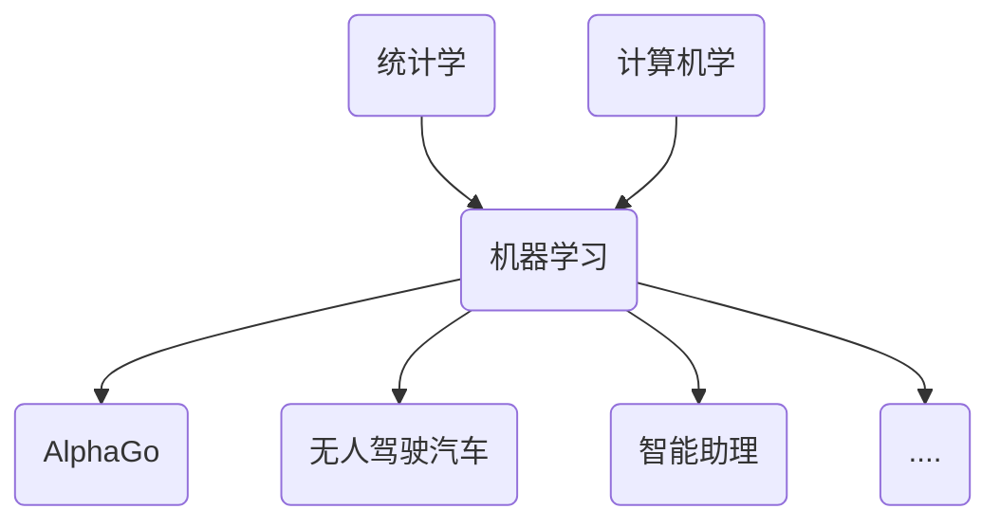
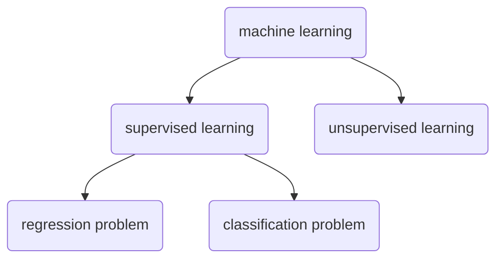
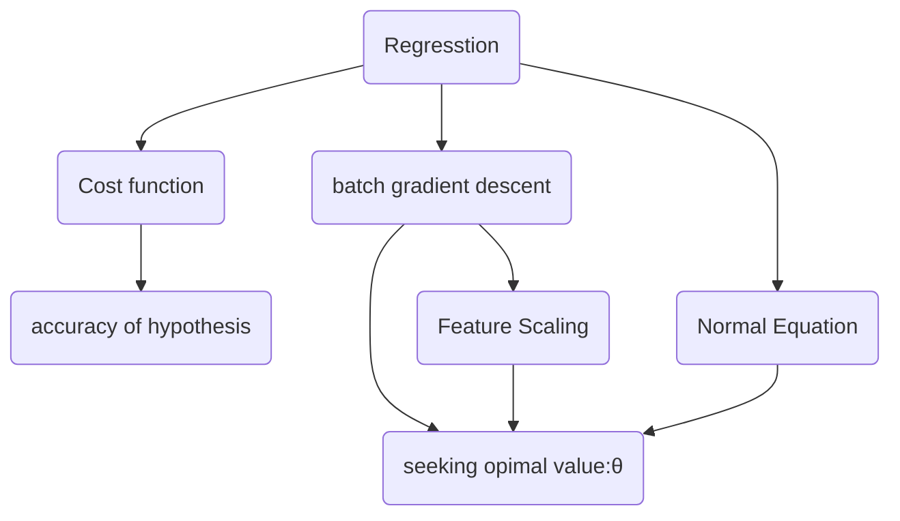

### 机器学习入门

[TOC]

#### 1.简介

#####  1.1 什么是机器学习

似乎在知乎找到答案:


又或者说:

> \- 1+1等于几 ？
>
> \- 50
> \- 傻x，多了
>
> \- 1+2等于几？
> \- 20
> \- 傻x，多了
>
> \- 3+4等于几
> \- 7
> \- 傻x，对了
>
> \- 6+9等于几
> \- 13
> \- 傻x，少了
>
> 很多很多次以后……
>
> \- 2+2等于几
> \- 4
>
> \- 4+5等于几
> \- 9

哈哈哈!允许我笑那么一会儿!

其真正的定义是:**A computer program is said to learn from experiene E with repect to  some class of  tasks T and performance measure P, if its performance at tasks in T,as measured by P  improves with experience E.**

#####  1.2机器学习的发展  

随着AlphaGo再一次在击败人类世界冠军,无人汽车领域的突破,人工智能助理等,其应用越来越广泛,机器学习的前途越发光明,可以说是一发不可收拾的状态!但我们知道任何事物的取得的都离不开其自身的发展,机器学习也一样!

20世纪90年代中期到 21 世纪 00 年代中期是机器学习发展的黄金时期,是统计学和科技学科的结合发展期!主要标志是学术界涌现出一批重要成果，比如，基于统计学习理论的**支持向量机、随机森林和 Boosting** 等集成分类方法，**概率图模型**，基于再生核理论的非线性数据分析与处理方法，**非参数贝叶斯方法**，基于正则化理论的**稀疏学习模型及应用**等等。这些成果奠定了统计学习的理论基础和框架。正因为有了前辈们这些贡献,才有现在机器学习的应用的前景,我猜不出几年,机器学习的应用会越来越火爆!所以抓住机会学一波!



####  2.octave的安装和使用

##### 2.1 octave安装

octave是一款用于数值计算和绘图的开源软件。是学习机器学习入门的较好软件,当然你也可以直接用Python,R,C++等语言进行开发!如果你是新手,建议先用octave/malab;如果你会Python等,那么你也可以选择直接用你这门语言。

终端键入:

```shell
brew install gcc
brew install Caskroom/cask/xquartz
brew install octave
```

等终端跑完就好,像是要梯子。别问我brew是啥!

在终端输入:`$ octave`出现如下界面:


##### 2.2 octave的使用

octave分为工作区,命令窗口,Editor三个区,也故名思议三个区负责不同的职责!工作区负责是变量存储,命令窗口负责键入执行命令,而Editor负责修改编辑文件!当然如果你觉得这个编译器不好(好渣)的话,你可以改用Sublime,Vim等比较主流的编辑器!这并没有什么影响!


ok,看到这里,如果你还没有完成octave的安装的话,那最好还请耐心的等等吧,但看下也无妨,哈哈!

1.在octave命令窗口键入:`>> 2+ 2`然后回车,你会看到命令窗口显示ans = 4;而左边的工作区则保存ans这个临时变量及相关的类,维度,值。恩!这是最简单的计算!

2.octave包括许多的内建函数,这给我们极大的计算方便,像sin,cos,log等,输入:`>>sin(3)`,你会看到输出ans = 0.14112;

3.octave允许你自定义变量来存储,例如键入`>>sum = 1 + 2 + 3 + 4`输出的就是sum = 10;而工作区是存储sum变量而不是ans。如果你需要查看某个变量的数值,输入其变量名并回车即可。如果你想查看当前名命名或者使用的函数
名和变量名,输入`>> who`

4.如果你需要从当前的变量空间中删除某个变量,`clear` 命令能移出所有的变量,或者移出某个特定变量,如:`clear name	`

5.octave的数值表示有两种,分别是`format long`和`format short`对应的是15位和5位~

6.载入与保存数据:当你要离开octave,但保存当前这些变量的话输入`save anyname` 系统将保存数据在你所在的目录下;然后重新加载的话是`load anyname`,如果你想保存时某些变量,那么键入`	save filename var1 var2 ...`

7.如果你对某些函数不太清楚其作用,你可以键入:`help commandname` 例如`help sqrt`

8.构造向量:

```octave
%常规构造
>> a=[1 4 5]
    a=
      1 4 5 
>> b=[2,1,0]
    b= 
      2 1 0
>> c=[4;7;10]
    c=
      4
      7
      10
>> e = [2;c]; 
    e= 
      2 
      4
      7
      10
>> f = 2 : 6 %冒号表达式构建
   f = 
       2 3 4 5 6
>> g = 2:0.3:3 %从第一个数字以第二个数字为递增速率到第三个数字
   e=
      2.0000 2.3000 2.6000 2.9000
```


9. 当然还有很多,比如说是绘图(plot),编写脚本文件,编写一个函数,3d绘图(plot3),编写一个可执行程序等等,然后不费口水了,点击[这里](https://github.com/blaceman/machine-learning-/blob/master/octave-tutorial-cn%20(2).pdf)查看具体教程,哈哈,偷懒的博主!

#### 3.Supervised Learning and Unsupervised Learning(监督学习与无监督学习)

##### 3.1 Supervised Learning(监督学习)

What's Supervised? ***In Supervised Learning,we are gived a data set and already know what our correct output should look like, having the idea that there is  a relationship between input and output.***

Supervised learning problems are categorized into **"regression" and "classification" problems.**

regression problems:**we are trying to predict result within a continuous output,meaning that we are trying to map intput avariable to some continuous funtion**.

classification problem:**we are trying to pridict result in a decreat output in other words, we are trying to map input variables into discrete categories**

##### 3.2 Unsupervised Learning(无监督学习)

***Unsupervised Learning  allow us to approach problem with little and no idea what our result should look like. we should  derive structure from the data where we don't necessarily know the effct of variable***

**We can derive this structure by clustering the data based on relationships among the variables in the data.**

With unsupervised learning there is no feedback based on the prediction results.

the figure below shows the machine learning structure:



#### 4.Linear Regression Problem

##### 4.1Cost Function

what's Cost Function? **it is usually used to measure accuracy of our hypothesis function**

That's need average difference of all results of the hypothesis with input from x's and the actual out y's. The math block below show:
$$
J(\theta_0,\theta_1 ,...) = \frac{1}{2m} \sum_{i=1}^m(h_\theta(x_i) - y_i)^2
$$
Suppose we use X(m * (n + 1)) matrix as my input variables ,Y(m * 1) matrix as my output variable,$\theta$((n + 1) * 1) as parameter of h$\theta$,so the math block is:
$$
J(\theta_0,\theta_1,...) = \frac{1}{2m}*(X * \theta - Y)^T * (X * \theta - Y)
$$
and the J($\theta_0​$,$\theta_1​$,…) closer to zero and more fit data!

As an example:we have some data set X = $\begin{bmatrix}1 \\2\\3\end{bmatrix}$,Y = $\begin{bmatrix}1\\2\\3\end{bmatrix}$,we can plot it in octave as below:


suppose h$\theta$ = $\theta_1x $+ $\theta_0$ ($\theta_0$ = 0);as $\theta_1$ = 2,$\theta_1 = 0.5$,$\theta_1$ = 1,the figure as:

and when $\theta_1$ =  2, J($\theta_1) $ = 2.3333; when $\theta_1$ =  0.5, J($\theta_1$)  = 0.58333; when $\theta_1$ =  1, J($\theta_1$)  = 0, so when J($\theta_1$)  = 0,it's more fit data.

the relationship between J($\theta_1$) and $\theta_1$ is:

If you have more data, you can see that this is a square function as shown above.when J($\theta_1$) approach 0,it's converges to approach  minimum and more fit data.So **cost function is usually used to measure accuracy of our hypothesis function**.

##### 4.2Gradient Descent

So we have our hypothesis function and we have a way of measuring how well it fits into the data. Now we need to estimate the parameters in the hypothesis function. That's where gradient descent comes in.

The gradient descent algorithm is:

repeat until convergence:

$\theta_j $:= $\theta_j$ - $\alpha$ $\frac{∂}{∂\theta}$J ($\theta_0$,$\theta_1$)

##### 4.3 Gradient Descent For Linear Regression

when we applied to the case of linear regression, a new gradient equation that is called **batch gradient descent** can be derived. as below shown:

Gradient Descent for Multiple Variables:

repeat until convergence:{
$$
\theta_j := \theta_j - a\frac{1}{m}\sum_{i = 1}^{m}(h_\theta(x^{(i)}) - y^{i})  x_{j}^{(i)}
$$
}

##### 4.4 Linear Regression Feature Scaling

we can speed up gradient descent by having each of input values **in roughly the same range**.because $\theta$ will descend quickly on small ranges and slowly on large ranges, and so will oscillate inefficiently down to the optimum when the variables are very uneven.

Ideally:

−1 ≤ x(i) ≤ 1

Two techniques to help with this are **feature scaling** and **mean normalization**:

$x_i$ := $\frac{x_i - u_i}{s_i}$

$u_i$ is the average of all the values for feature(i) and $s_i$ is the range of values(max - min),or $s_i$ is the standard deviation.

##### 4.5 Polynomial Regression

Our hypothesis need not be linear(a straight line)if that does fit the data well.

we can **change behavior and curve** of our hypothesis function by making quadratic,cubic or square root function.

One important thing to keep in mind is, if you choose your features this way then feature scaling becomes very important.

eg. if x1 has range 1 - 1000 then range of x21 becomes 1 - 1000000 and that of x31 becomes 1 - 1000000000.

##### 4.6 Linear Regresstion Normal Equation

Gradient descent gives one way of minizing J.Let's discuss a second way of doing so,this time performing the minimization explicitly and without resoring to an iterative algorithm.the normal equation formula is given below:
$$
\theta = (X^T * X)^{-1} X^Ty
$$
The following is a comparison of gradient descent and the normal equation:

| Gradient Descent          | Normal equation                          |
| ------------------------- | ---------------------------------------- |
| Need to choose alpha      | No need choose alpha                     |
| Need many iteration       | No need to iterate                       |
| O(k$n^2$)                 | O($n^3$),need to calculate inverse of $X^T$X |
| Work well when n is large | Slow if n is large                       |

To summarize regression of the bove:



#### 5.Classification Regression Problem

##### 5.1 Classifican Hypothesis Representation

Sigmoid Function or Logistic Function:

$h_\theta$(x) = g($\theta^T$x)

z = $\theta$x

g(z) = $\frac{1}{1 + e^{-z}}$

The following image shows us what the sigmoid function looks like:The function g(z),shown here,map any real number to the(0,1)interval

hθ(x) will give us the **probability** that our output is 1. For example, hθ(x)=0.7 gives us a probability of 70% that our output is 1. Our probability that our prediction is 0 is just the complement of our probability that it is 1 (e.g. if probability that it is 1 is 70%, then the probability that it is 0 is 30%).

```
hθ(x)=P(y=1|x;θ)=1−P(y=0|x;θ)
P(y=0|x;θ)+P(y=1|x;θ)=1
```

##### 5.2 Decision Boundary

in order to get our discreat 0 or 1 classification,we can translate the output of the hypothesis function as follows:

$h_\theta$(x)$\ge$ 0.5 -> y = 1

$h_\theta$(x)$\le$ 0.5 -> y = 0

and 

$h_\theta = g(\theta^Tx)\ge0.5$,when $\theta^Tx \ge 0$

so

$\theta^T \ge 0 \rightarrow y =1$

$\theta^T < 0 \rightarrow y =0$

The **decision boundary** is the line that separates the area where y = 1 and y = 0.it is created by hypothesis function.

##### 5.3 Logistic Regression Cost Function

We cannot use the same cost function that we use for linear regression because the Logistic Function will cause the output to be wavy, causing many local optima. In other words, it will not be a convex function.

Instead, our cost function for logistic regression looks like:
$$
J(\theta) = \frac{1}{m}Cost(h_\theta(x^{(i)}),y^{(i)})
$$
If y = 1:
$$
Cost(h_\theta(x^{(i)}),y^{(i)}) = -log(h_\theta(x))
$$
If y = 0:
$$
Cost(h_\theta(x^{(i)}),y^{(i)}) = -log(1 - h_\theta(x))
$$
When y = 1,we get the follow plot for J($\theta$) vs $h_\theta(x)$:


In contrast,when y = 0, we can get as below:


When Cost($h_\theta(x),y$) = 0, $h_\theta(x)$ = y.in contrast, when $h_\theta(x)$ = y, Cost($h_\theta$(x),y) = 0.

We can compress our function's two conditional case into case:
$$
Cost(h_\theta(x),y) = -ylog(h_\theta(x))-(1 - y)log(1 - h_\theta(x))
$$
A vectorized implementation is:
$$
h = g(X\theta)
$$

$$
J(\theta) = \frac{1}{m} .(-y^Tlog(h)-(1-y)^Tlog(1 -h))
$$

##### 5.4 Simplified Gradient Descent

Repeat{
$$
\theta_j := \theta_j - a\frac{1}{m}\sum_{i = 1}^{m}(h_\theta(x^{(i)}) - y^{i})  x_{j}^{(i)}
$$
}

A Vectorized implementation is:
$$
\theta = \theta - \frac{a}{m}X^T(g(X\theta) - \vec{y} ))
$$

##### 5.5 Advance Optimization

Octave provides library to calculate optimize $\theta$,so we only use it

We first need to provide a function that evaluates the following two function for a given input value $\theta$:

J($\theta$)

$\frac{∂}{∂\theta_j}J(\theta)$

We can write a single function that both of these

```octave
function [jVal,gradient] = CostFunction(theta)
jVal = [...code to compute J(theta)...];
gradient = [...code to compute derivate of J(theta)...];
end
```

then we can use octave's"fminuce()" optimization algorithm along the "optimset()" function that creates an object containing the options we want to send to "fiminuc()"

```octave
options = optimset('GradObj','on','MaxIter',100);
initialTheta = zeros(2,1);
[optTheta,functionVal,exitFlag] = fminunc(@cosFunction,initialTheta,options);
```

##### 5.6 Multiclass Classfication:One-vs-all

Now will approach the classification of data when we have more than categories.insted of y = {0,1} we will expand our definition  so that y = {0,1…n}.

Since y = {0,1,…n},we divide our problem into n+1 binary classification problems;in each one, we predict the probability that 'y' is a member of one of our classes.

```
y∈{0,1...n}
h(0)θ(x)=P(y=0|x;θ)
h(1)θ(x)=P(y=1|x;θ)
⋯
h(n)θ(x)=P(y=n|x;θ)
prediction=maxi(h(i)θ(x))
```

We are basically choosing one class and then lumping all the others into a single second class. We do this repeatedly, applying binary logistic regression to each case, and then use the hypothesis that returned the highest value as our prediction.such as:


To make a prediction on a new x, pick the class that maximizes $h_\theta(x)$.

#### 6.Solving the Problem of Over fitting

##### 6.1 The Problem of Overfitting


The figure on the left shown an instance of underfitting- in which the data clearly structure not captured by the model-and the figure on the right is an example of overfilling.

**Underfitting,or high bias**,is when the form of our hypothesis function h maps poorly to the trend of the data It is usually caused by a function that is too simple or use too few features.

**Overfitting, or hight variance**,,is caused by hypothesis function that fit the available data but don't generalize well to predict new data.It is usually caused by a complicated function that creates a lot of unnecessary curves and angles unrelated to the data.

This terminology is applied to both linear and logistic regression.there are two option to address the issue of overfitting

1)Reduce the number of features:

- Manually select which features to keep.
- Use a model selection algorithm(studied later in the course)

2) Regularization

- Keep all the features,but reduce the magnitude of parameters $\theta_j$
- Regularization works well when we have a lot of slightly useful features.

##### 6.2 Cost Function

We regularize all of our theta paramter in single summation as:
$$
min_\theta\frac{1}{2m} \sum_{i = 1}^{m}(h_\theta(x^{(i)}) - y^{(i)})^2 + \lambda\sum_{j = 1}^{n}\theta_{j}^2
$$
The $\lambda$,or lambda,is the regularization parameter. it determines how much the cost of theta are inflated.

##### 6.3 Regularized Linear Regression

 We can apply regularization to lineat regression and logistic regression

Gradient Descent 

We will modify our gradient descent function to separate out θ0 from the rest of the parameters because we do not want to penalize θ0

Repeat{
$$
\theta_0 := \theta_0 - a \frac{1}{m}\sum_{i = 1}^{m}(h_\theta(x^{(i)}-y^{(i)})x_0^{(i)}
$$

$$
\theta_j := \theta_j - a [(\frac{1}{m}\sum_{i = 1}^{m}(h_\theta(x^{(i)})-y^{(i)})x_j^{(i)}) + \frac{\lambda}{m}\theta_j]------j>0
$$

}

The term $\frac{\lambda}{m}\theta_j$ performs our regularization. With some manipulation our update rule can also be represented as:
$$
\theta_j := \theta_j(1 -a\frac{1}{m}) - a\frac{1}{m}\sum_{i = 1}^{m}(h_\theta(x^{(i)}) - y^{(i)})x_j^{(i)}
$$
The first term in the above equation, 1−αλm will always be less than 1. Intuitively you can see it as reducing the value of θj by some amount on every update. Notice that the second term is now exactly the same as it was before.

Normal Equation

Now let's approach regularzation using the alternate method of the non-iterative normal equation.
$$
\theta = (X^T + \lambda *L)^{-1}X^Ty
$$

$$
Where: L = \begin{bmatrix}0   & &&         \\
                                   & 1  & &           \\
                                    & & \ddots&  \\
                                    & & & 1
                                    
        \end{bmatrix}
$$

L is a matrix with 0 at the top left and 1's down the diagonal, with 0's everywhere else. It should have dimension (n+1)×(n+1). Intuitively, this is the identity matrix (though we are not including x0), multiplied with a single real number λ.

Recall that if m < n, then XTX is non-invertible. However, when we add the term λ⋅L, then XTX + λ⋅L becomes invertible.


##### 6.4 Regularized Logistic Regression

Cost Function:
$$
J(\theta) = -\frac{1}{m}\sum_{i = 1}^{m}[y^{(i)}log(h_\theta(x^{(i)}))+(1 - y^{(i)})log(1 - h_\theta(x^{(i)})) ]+ \frac{\lambda}{2m}\sum_{j = 1}^{n}\theta_j^2
$$


#### 7.Netral Networkings 

 